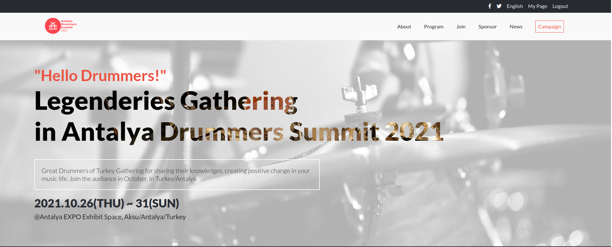
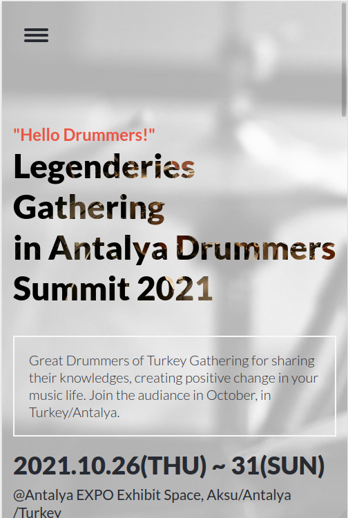

# Antalya Drummers Summit - Module 1 Capstone Project.

> This is the Microverse's module 1 capstone project. This project made based on [Cindy Shin's Creative Common Global Summit 2015 Design](https://www.behance.net/adagio07).

Additional description about the project and its features.

## Built With

- HTML&CSS.
- JavaScript.
- Cindy Chin's CC GlobalSummit Template.
- Web Browser Tools.

## Live Demo

You can find [Live Demo Link](https://luftedar.github.io/capstone-project-1/). You can check [loom](https://www.loom.com/share/69421f26f2b34794b81b8c0e83cdc68c) for description.

## Getting Started

To get a local copy up and running follow these simple example steps.

Clone the project by:

git clone git@github.com:luftedar/capstone-project-1.git

cd into the project folder by:

cd capstone-project-1

Open folder with code editor

### Prerequisites

- Code Editor.
- Web Browser

## Authors

👤 **Orçun Uğur**

- GitHub: [@githubhandle](https://github.com/luftedar)
- Twitter: [@twitterhandle](https://twitter.com/OrcunUgur2)
- LinkedIn: [LinkedIn](https://www.linkedin.com/in/orcunugur)

## 🤝 Contributing

Contributions, issues, and feature requests are welcome!

Feel free to check the [issues page](../../issues/).

## Show your support

Give a ⭐️ if you like this project!

## Acknowledgments

- [Cindy Shin](https://www.behance.net/adagio07) whose design template was used to create this project.
- Thanks to my teammates, learning, coding partners, code reviewers.
- This project is part of Capstone week of module 1 in the Microverse study program.
- Thanks to the Microverse team for the great curriculum.

## 📝 License

This project is [MIT](./MIT.md) licensed.
